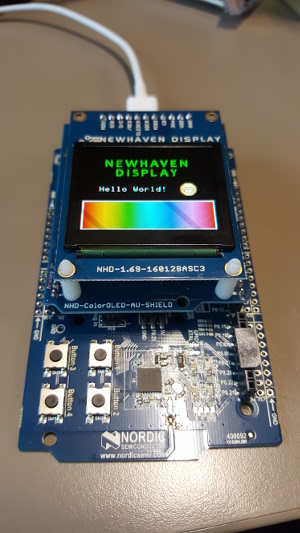

# NewHaven OLED 1.69 display on NRF51 board

[](https://drone.io/github.com/bertrandmartel/newhaven-oled-dk51/latest)

Integration of NewHaven OLED 1.69 display on Nordic Semiconductor NRF51 DK board



Based on project : https://github.com/NewhavenDisplay/NHD-1.69-160128ASC3_Example

## Scope

* SPI communication between NRF51 board & display
* fill screen with specified color
* buttons 3 & 4 on NRF51 DK board switch through a sequence of color/image
* draw 160x128 bitmap (a 24 bit bitmap image input will give an image with 3x6 bit/pixel)

## Configuration

* armgcc toolchain
* no softdevice flash required
* nRF5 SDK 11.0.0

## Setup/Installation

* follow SDK/Toolchain Installation steps section of <a href="https://gist.github.com/bertrandmartel/a38315c5fe79ec5c8c6a9ed90b8df260#installation-steps">this tutorial</a>

* specify NRF51 SDK directory with :

```
export NRF51_SDK_DIR=/path/to/sdk
```

## Build

```
make
```

## Upload

```
//erase firmware
nrfjprog --family  nRF51 -e

//upload firmware
nrfjprog --family  nRF51 --program _build/nrf51422_xxac.hex

//start firmware
nrfjprog --family  nRF51 -r
```

or 

```
./upload.sh
```

To debug your code : <a href="https://gist.github.com/bertrandmartel/a38315c5fe79ec5c8c6a9ed90b8df260#debug-your-code">check this link</a>

## License

The MIT License (MIT) Copyright (c) 2016 Bertrand Martel