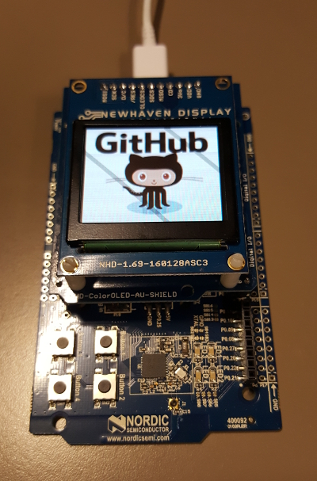

# NewHaven OLED 1.69 display on DK51 board

[](https://drone.io/github.com/akinaru/newhaven-oled-dk51/latest)

Integration of NewHaven OLED 1.69 display arduino example on Nordic DK51 board



Original project : https://github.com/NewhavenDisplay/NHD-1.69-160128ASC3_Example

## Setup/Installation

* follow SDK/Toolchain installation steps section of https://gist.github.com/akinaru/a38315c5fe79ec5c8c6a9ed90b8df260

* specify NRF51 SDK directory with :

```
export NRF51_SDK_DIR=/path/to/sdk
```

## Build

```
cd pca10028
make
```

## Upload

```
//erase firmware
nrfjprog --family  nRF51 -e

//upload firmware
nrfjprog --family  nRF51 --program _build/nrf51422_xxac.hex

//start firmware
nrfjprog --family  nRF51 -r
```

To debug watch `Debug your code` section of https://gist.github.com/akinaru/a38315c5fe79ec5c8c6a9ed90b8df260

## License

The MIT License (MIT) Copyright (c) 2016 Bertrand Martel